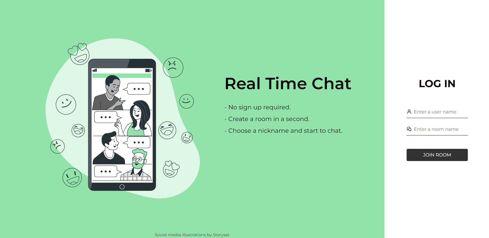
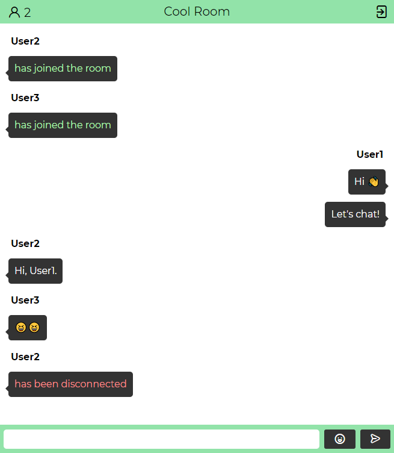
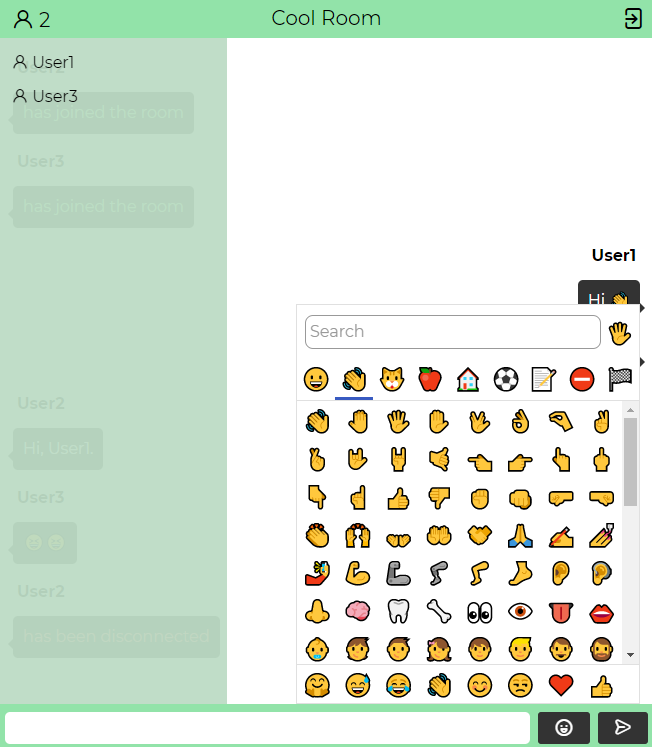

# Real Time Chat with Socket.io

This project developed by Volkan Dağdelen with using web sockets [socket.io](https://socket.io/).

Live Demo: https://chat-yapp.herokuapp.com/

## Features
🚀 Real Time chat experience with web sockets.  
🚀 Online users information  
🚀 {User} is typing... functionality  
🚀 Saves chat messages on firebase until all users left  
🚀 Send emoji with using [Emoji Picker Element Library](https://github.com/nolanlawson/emoji-picker-element)  
🚀 Responsive design  

## Media

Chat Screen 1             |  Chat Screen 2
:-------------------------:|:-------------------------:
 | 

## LICENSE

MIT LICENSE

